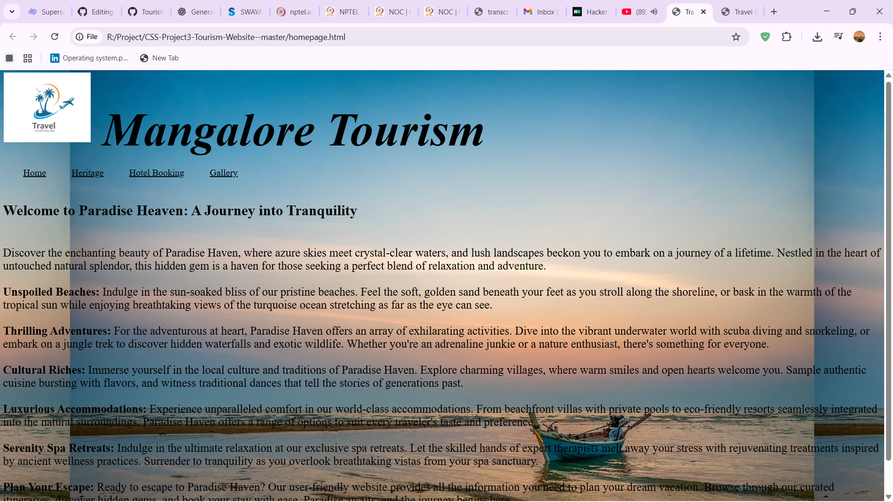
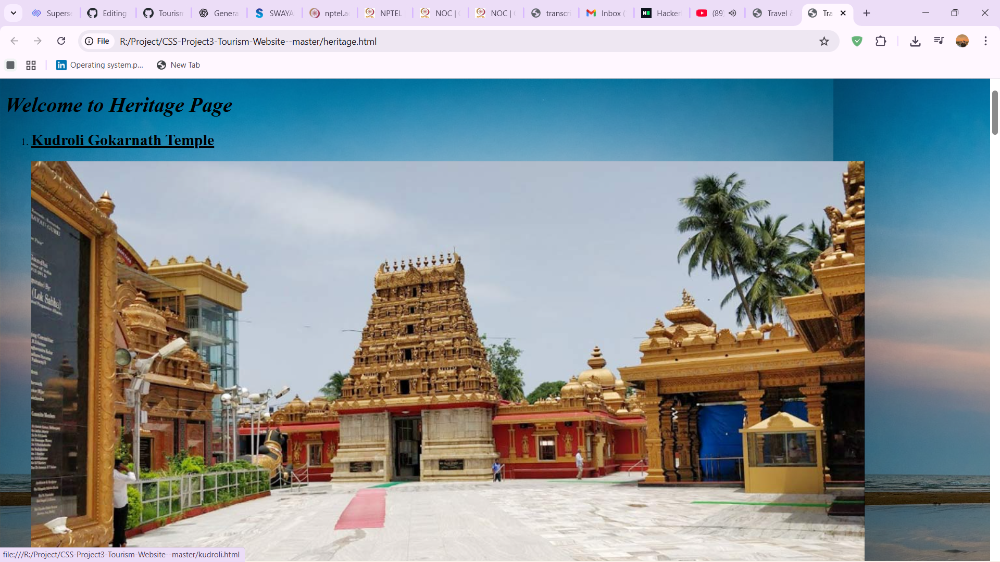

# 🌍 Tourism Website

A responsive and visually appealing tourism website showcasing destinations, travel guides, and booking information.  
Built to inspire and help travelers plan their perfect trip.

---

## ✨ Features

- 🏖️ **Beautiful Destinations** – Highlighted attractions with images and descriptions.  
- 📍 **Interactive Maps** – Helps users locate tourist spots easily.  
- 📅 **Trip Planner** – Option to plan and customize itineraries.  
- 📱 **Responsive Design** – Works on mobile, tablet, and desktop.  
- 📰 **Travel Blog Section** – Articles, tips, and travel stories.

---

## 🛠️ Tech Stack

- **Frontend:** HTML5, CSS3, JavaScript  
- **Frameworks/Libraries:** [Bootstrap/Tailwind] (if used)  
- **Backend:** [Node.js / PHP / etc.] *(if applicable)*  
- **Database:** [MySQL / MongoDB / etc.] *(if applicable)*  

---

## 📸 Screenshots

| Homepage | Destinations |
|----------|--------------|
|  |  |


---

## 🚀 Getting Started

### 1️⃣ Clone the Repository
```bash
[git clone https://github.com/yourusername/tourism-website.git](https://github.com/rakhi1826/Tourism-Website.git)
cd tourism-website
```
2️⃣ Open in Browser

Simply open the index.html file in your browser.

(If backend is included, specify installation and run steps here.)

# 📂 Project Structure

tourism-website/
│
├── index.html
├── about.html
├── contact.html
├── css/
│   └── style.css
├── js/
│   └── script.js
├── images/
└── README.md


# 🤝 Contributing

Contributions are welcome!

Fork the repo

Create a branch: git checkout -b feature-name

Commit changes: git commit -m "Added new feature"

Push to branch: git push origin feature-name

Create a Pull Request

# 📜 License

This project is licensed under the MIT License – see the LICENSE file for details.

# 📬 Contact

Your Name – potugangaprasad26@gmail.com
GitHub: https://github.com/rakhi1826
